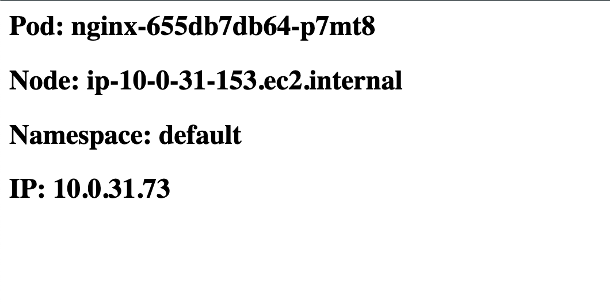

# Project: `EKS` Cluster & `NGINX`

> Howdy :wave: :wave: Thanks for your time in reviewing my write-up! I'm genuinely excited to receive any feedback you might have (pardon me for my poor Terraform code...). I am still a beginner to Terraform so there are still lots of ground for learning and improvements. Let's dive right in and terraform the :cloud:!

## :gear: Techstack

- ![terraform][terraform]
- ![kubernetes][kubernetes]
- ![bash][bash]
- ![aws][aws]

## :page_with_curl: Project Requirements

### 1. `AWS`

We are using `EKS`, the managed `Kubernetes` service from `Amazon`. In terms of deployment model, it would be [**Running Amazon EKS in the cloud**](https://aws.amazon.com/eks/) (`AWS` offers other models, e.g: Hybrid, on-premise, etc)

#### Region

- Region (I pick the nearest one): `us-east-1` (N. Virginia)
- AZ(s):
  - `us-east-1a`
  - `us-east-1b`

#### Compute

`EKS` requires worker nodes to runs its workload (containerized app). There are a several ways to operate nodes on an `EKS` cluster. To take advantage of `AWS` built-in automation in provisioning and managing`EC2` instances (e.g: Auto Scaling Group), I am using `Managed node group` to launch worker nodes.

> **Read more**: [Managed Node Groups on EKS](https://docs.aws.amazon.com/eks/latest/userguide/managed-node-groups.html)

- **3 worker nodes**
  - Instance type: `t3.small`, `ON_DEMAND`
  - Launched as within a same `Auto Scaling` group
  - Distributed across 2 `AZs`, `us-east-1a` and `us-east-1b`, on a single `Region`, `us-east-1a`
  - **Note**: I don't plan to set up `Autoscaling` (e.g: `ClusterAutoscaler`) for this lab. We should expect that the number of worker nodes remain statically at  `3`.

#### Networking

- 1 VPC
- 4 subnets:
  - 2 private across 2 AZs
  - 2 public across 2 AZs

**Reference**:

- [Network Requirements](https://docs.aws.amazon.com/eks/latest/userguide/network_reqs.html)

### 2. `Kubernetes`

- `Nginx` Deployment
  - 1 Pod / Worker
  - Request to `/` returns pod-name, node-name, pod namespace, and pod IP

- Service `Load Balancer` as the front-end for web server pods
  - Every time we refresh browser, it should periodically return different info about the web
  service pods

## Automation Step-by-step

### Overview

Before moving on, here a quick overview on the directory structure for this lab:

```bash
.
├── k8s
│   └── nginx.yml
└── web
    └── cmd-nginx.sh
├── README.md
├── eks.tf
├── networks.tf
├── nginx-deployment.tf
├── note.md
├── outputs.tf
├── provider.tf
├── variables.tf
```

- `k8s` dir:
  - `nginx.yml`: `YAML` manifest for `NGINX` deployment
- `web` dir:
  - `cmd-nginx.sh`: simple script to customized `CMD` for `Nginx`'s container
- `.tf` files: `terraform`-ing resources on `AWS`
  - `output.tf`: variables to be displayed to `STDOUT` when `tf apply` completes
  - `variables.tf`: for declaration of variables and specifications about those
  - `eks.tf`: setting up `EKS` cluster, `eks-lab`, and a managed-node group, `node-group-1`
  - `networks.tf`: creating network resources, including subnets, route tables, NAT gateway, Internet gateway, and VPC
  - `nginx-deployment.tf`: deploying an `NGINX` deployment & setting a `LoadBalancer` service with `Terraform`

> I try to do this lab the "manual way" by using `resource` to create resources/infrastructure instead of using modules (e.g: [terraform-aws-eks](https://github.com/terraform-aws-modules/terraform-aws-eks)) to understand the process better

### :satellite: Networks

#### 1. `VPC` & Subnets

First we start with the `VPC` with the `CIDR` block of `10.0.0.0/16`

```terraform
resource "aws_vpc" "vpc_eks" {
  cidr_block = var.vpc_cidr_block

  tags = var.eks_resource_general_tags
}
```

There are 4 subnets to be created, **2 private** and **2 public** subnets:

- **Private**: 1 on `us-east-1a` and 1 on `us-east-1b`

```terraform
resource "aws_subnet" "us-east-1a-private" {
  vpc_id            = aws_vpc.vpc_eks.id
  availability_zone = var.azs[0]
  cidr_block        = var.private_cidr_blocks[0]


  tags = merge({ "Name" : "${var.azs[0]}-private" }, var.private_lb_tags)
}

resource "aws_subnet" "us-east-1b-private" {
  vpc_id            = aws_vpc.vpc_eks.id
  availability_zone = var.azs[1]
  cidr_block        = var.private_cidr_blocks[1]

  tags = merge({ "Name" : "${var.azs[1]}-private" }, var.private_lb_tags)
}
```

- **Public**: Same AZs for public subnets. We use these subnet to allow Internet connection for instances in private subnets

```terraform
resource "aws_subnet" "us-east-1a-public" {
  vpc_id            = aws_vpc.vpc_eks.id
  availability_zone = var.azs[0]
  cidr_block        = var.public_cidr_blocks[0]

  map_public_ip_on_launch = true

  tags = merge({ "Name" : "${var.azs[0]}-public" }, var.public_lb_tags)
}

resource "aws_subnet" "us-east-1b-public" {
  vpc_id            = aws_vpc.vpc_eks.id
  availability_zone = var.azs[1]
  cidr_block        = var.public_cidr_blocks[1]

  map_public_ip_on_launch = true

  tags = merge({ "Name" : "${var.azs[1]}-public" }, var.public_lb_tags)
}
```

**Reference**:

- [Configuring `aws_subnet`](https://registry.terraform.io/providers/hashicorp/aws/latest/docs/resources/subnet)

#### 2. Internet Connection

For Internet Connection, there are 2 resources:

- Internet Gateway

```terraform
resource "aws_internet_gateway" "igw" {
  vpc_id = aws_vpc.vpc_eks.id

  tags = var.igw_tags
}
```

- NAT Gateway:
  - Create an `EIP` and attach to the GW
  - attach this NAT GW to the public subnet in `us-east-1a-public` (*In actual deployment, there should be 2 NAT on 2 different AZs for redundancy. Setting up 1 for now in this lab for simplicity*)

```terraform
resource "aws_eip" "eip_nat" {
  tags = var.eip_tags
}

resource "aws_nat_gateway" "nat" {
  allocation_id = aws_eip.eip_nat.id

  # attach this to a public subnet
  subnet_id = aws_subnet.us-east-1a-public.id

  tags = var.nat_gw_tags

  depends_on = [aws_internet_gateway.igw]
}
```

**Reference**:

- [Configuring `aws_nat_gateway`](https://registry.terraform.io/providers/hashicorp/aws/latest/docs/resources/nat_gateway)

**Read more**:

- [Step-by-step set up NAT Gateway](https://docs.aws.amazon.com/appstream2/latest/developerguide/add-nat-gateway-existing-vpc.html)
- [Sample NAT Gateway setup](https://docs.aws.amazon.com/vpc/latest/userguide/nat-gateway-scenarios.html)

#### 3. Route table(s)

2 route tables:

- **Public**: Connections to the internet route through the Internet Gateway

```terraform
# Public route table
resource "aws_route_table" "rt_public" {
  vpc_id = aws_vpc.vpc_eks.id

  route {
    cidr_block = "0.0.0.0/0"
    gateway_id = aws_internet_gateway.igw.id
  }

  tags = var.public_rt_tags
}
```

- **Private**: Routing connection through the created NAT Gateway

```terraform
# Private Route Table
resource "aws_route_table" "rt_private" {
  vpc_id = aws_vpc.vpc_eks.id

  route {
    cidr_block = "0.0.0.0/0"
    gateway_id = aws_nat_gateway.nat.id
  }

  tags = var.private_rt_tags
}

```

**Notes**: The subnets MUST be tagged with specific tags so that **LoadBalancer**
 can be created later (LB can be launched on both subnet types):

```bash
# Private subnet
"kubernetes.io/role/internal-elb" = "1"
"kubernetes.io/cluster/eks-lab"   = "owned"

# public subnet
"kubernetes.io/role/elb"        = "1"
"kubernetes.io/cluster/eks-lab" = "owned"
```

The last step in this section is associating the **route tables** with the **according subnets**

```terraform
resource "aws_route_table_association" "rt-us-east-1a-private" {
  subnet_id      = aws_subnet.us-east-1a-private.id
  route_table_id = aws_route_table.rt_private.id
}

resource "aws_route_table_association" "rt-us-east-1b-private" {
  subnet_id      = aws_subnet.us-east-1b-private.id
  route_table_id = aws_route_table.rt_private.id
}

resource "aws_route_table_association" "rt-us-east-1a-public" {
  subnet_id      = aws_subnet.us-east-1a-public.id
  route_table_id = aws_route_table.rt_public.id
}

resource "aws_route_table_association" "rt-us-east-1b-public" {
  subnet_id      = aws_subnet.us-east-1b-public.id
  route_table_id = aws_route_table.rt_public.id
}
```

### :computer: `EKS`

#### `EKS` Cluster

Before setting up the `EKS` cluster, we start with creating IAM role & policy to allow the cluster interacting with `AWS` resources:

- Create a role, `eks-assume-role`, for the `EKS` Service
- Attach an IAM policy, `AmazonEKSClusterPolicy`, to the created role
  - [AmazonEKSClusterPolicy](https://docs.aws.amazon.com/aws-managed-policy/latest/reference/AmazonEKSClusterPolicy.html) = *giving Kubernetes the permissions it requires to manage resources on your behalf*

```terraform
data "aws_iam_policy_document" "eks-assume-role" {
  statement {
    effect = "Allow"

    principals {
      type        = "Service"
      identifiers = ["eks.amazonaws.com"]
    }

    actions = ["sts:AssumeRole"]
  }
}

resource "aws_iam_role" "eks-lab-iam-role" {
  name               = "eks-lab-iam-role"
  assume_role_policy = data.aws_iam_policy_document.eks-assume-role.json
}

# Permission for EKS to manage resources
resource "aws_iam_role_policy_attachment" "eks-lab-AmazonEKSClusterPolicy" {
  policy_arn = "arn:aws:iam::aws:policy/AmazonEKSClusterPolicy"
  role       = aws_iam_role.eks-lab-iam-role.name
}
```

Configuring the `EKS` cluster:

- Attach the IAM role `eks-lab-iam-role` to this `EKS` cluster
- Attach the 4 subnets from above to the cluster

```terraform
resource "aws_eks_cluster" "eks-lab" {
  name     = var.cluster_name
  version  = var.cluster_version
  role_arn = aws_iam_role.eks-lab-iam-role.arn

  depends_on = [aws_iam_role_policy_attachment.eks-lab-AmazonEKSClusterPolicy]

  vpc_config {
    subnet_ids = [
      aws_subnet.us-east-1a-private.id,
      aws_subnet.us-east-1b-private.id,
      aws_subnet.us-east-1a-public.id,
      aws_subnet.us-east-1b-public.id
    ]
  }
}
```

#### `EKS` - Managed Node Group

**Node Group** = an EC2 Autoscaling Group managed by `EKS` (Refer: [Managed Node Group - AWS](https://docs.aws.amazon.com/eks/latest/userguide/managed-node-groups.html))

Again, before setting up this resource, we must configure the IAM role and policies for the nodes:

- Policy included in the `eks-nodes-iam-role` IAM role:
  - [`AmazonEKS_CNI_Policy`](https://docs.aws.amazon.com/aws-managed-policy/latest/reference/AmazonEKS_CNI_Policy.html): *provides the Amazon VPC CNI Plugin (amazon-vpc-cni-k8s) the permissions it requires to modify the IP address configuration on your EKS worker nodes*
  - [`AmazonEKSWorkerNodePolicy`](https://docs.aws.amazon.com/aws-managed-policy/latest/reference/AmazonEKSWorkerNodePolicy.html): *Allowing `EKS` worker nodes to connect to `EKS` Clusters*
  - [`AmazonEC2ContainerRegistryReadOnly`](https://docs.aws.amazon.com/aws-managed-policy/latest/reference/AmazonEC2ContainerRegistryReadOnly.html): *read-only access to Amazon EC2 Container Registry repositories.*

```terraform
data "aws_iam_policy_document" "eks-nodes-assume-role" {
  statement {
    effect = "Allow"

    principals {
      type        = "Service"
      identifiers = ["ec2.amazonaws.com"]
    }

    actions = ["sts:AssumeRole"]
  }
}

# Creating a role for EC2 instances
resource "aws_iam_role" "eks-nodes-iam-role" {
  name               = "eks-nodes-iam-role"
  assume_role_policy = data.aws_iam_policy_document.eks-nodes-assume-role.json
}

# Granting permission for EKS CNI plugin (built-in on EKS)
resource "aws_iam_role_policy_attachment" "eks-nodes-AmazonEKS_CNI_Policy" {
  policy_arn = "arn:aws:iam::aws:policy/AmazonEKS_CNI_Policy"
  role       = aws_iam_role.eks-nodes-iam-role.name
}

# Refer: https://docs.aws.amazon.com/aws-managed-policy/latest/reference/AmazonEKSWorkerNodePolicy.html
# Allowing EKS worker nodes to connect to EKS Cluster
resource "aws_iam_role_policy_attachment" "eks-nodes-AmazonEKSWorkerNodePolicy" {
  policy_arn = "arn:aws:iam::aws:policy/AmazonEKSWorkerNodePolicy"
  role       = aws_iam_role.eks-nodes-iam-role.name
}

resource "aws_iam_role_policy_attachment" "eks-nodes-AmazonEC2ContainerRegistryReadOnly" {
  policy_arn = "arn:aws:iam::aws:policy/AmazonEC2ContainerRegistryReadOnly"
  role       = aws_iam_role.eks-nodes-iam-role.name
}

```

**Read more**:

- [Amazon EKS node IAM role](https://docs.aws.amazon.com/eks/latest/userguide/create-node-role.html): list of required IAM roles for a worker node

At this point, we can go ahead and set up the `node-group-1` as a `aws_eks_node_group` resource:

- This node group runs in private subnets across 2 AZs (Refer to `subnet_ids` config)
- EC2 instance type = `t3.small`
- EC2 capacity type = `ON_DEMAND`
- Minimum group size = `3` instances

```terraform
resource "aws_eks_node_group" "node-group-1" {

  # cluster info
  cluster_name = aws_eks_cluster.eks-lab.name
  version      = var.cluster_version

  node_group_name = var.node_group_name
  node_role_arn   = aws_iam_role.eks-nodes-iam-role.arn
  subnet_ids = [
    aws_subnet.us-east-1a-private.id,
    aws_subnet.us-east-1b-private.id
  ]

  scaling_config {
    desired_size = 3
    max_size     = 6
    min_size     = 3
  }

  update_config {
    max_unavailable = 1
  }

  depends_on = [
    aws_iam_role_policy_attachment.eks-nodes-AmazonEKSWorkerNodePolicy,
    aws_iam_role_policy_attachment.eks-nodes-AmazonEKS_CNI_Policy,
    aws_iam_role_policy_attachment.eks-nodes-AmazonEC2ContainerRegistryReadOnly,
  ]

  # Configuration for Instance(s)
  capacity_type  = var.capacity_type
  instance_types = var.instance_types
}
```

#### `Kubernetes` workloads

After above steps, the `EKS` cluster with `3` worker nodes should be all set.

We can move forward with deploying the workloads on the cluster.

In above steps, it has been our machine interacting with `AWS` APIs using the credentials provided through `AWS CLI`. Now, we want to communicate with the `k8s`  Cluster's `API-server`. The below code helps us to configure `kubeconfig` for connecting to the `eks-lab` cluster:

```terraform
provider "kubernetes" {
  host                   = aws_eks_cluster.eks-lab.endpoint
  cluster_ca_certificate = base64decode(aws_eks_cluster.eks-lab.certificate_authority.0.data)
  exec {
    api_version = "client.authentication.k8s.io/v1beta1"
    args        = ["eks", "get-token", "--cluster-name", var.cluster_name]
    command     = "aws"
  }
}
```

In this lab, we aim to launch a `NGINX` deployment with 3 replicas.

There are some requirements for this `NGINX` deployment:

**1. Customized `index.html`**:

As specified, on each Pod, the customized `index.html` should display these following details about the Pod and the worker node:

- `POD_NAMESPACE`
- `POD_ID`
- `POD_NAME`
- `NODE_NAME`

Initially, I had a few rough ideas to meet this requirement:

- **EC2 Instance Metadata**: I recalled that each `EC2` instance can [retrieve metadata from an HTTP endpoint](https://docs.aws.amazon.com/AWSEC2/latest/UserGuide/instancedata-data-retrieval.html). However, this doesn't work really well as `NGINX` is deployed as a container and we also needs specific info about the Pod (namespace, Pod name)
- **Render the customized `index.html` on our machine**: so this idea is simply "hard-code" the info about each of the Pod/Node onto HTML files and deploy those to the according worker node.
- **Using environment variables**: Env var was the best option as it is more dynamic comparing to others. After some searching, I found a way to [inject Pod fields (from `metadata` and `spec`) as values for env vars for container](https://kubernetes.io/docs/tasks/inject-data-application/environment-variable-expose-pod-information/#use-pod-fields-as-values-for-environment-variables). For example:

  ```yaml
  ...
      env:
        - name: MY_NODE_NAME
          valueFrom:
            fieldRef:
              fieldPath: spec.nodeName
        - name: MY_POD_NAME
          valueFrom:
            fieldRef:
              fieldPath: metadata.name
  ...
  ```

**2. 1 Pod / worker node**:

To ensure that 1 worker node hosts only 1 `nginx` Pod, my first idea was using the [`Anti-affinity/Affinity`](https://kubernetes.io/docs/concepts/scheduling-eviction/assign-pod-node/#affinity-and-anti-affinity) concept in `k8s`. Some Google search introduced me with another approach using `topologySpreadConstraints` to distribute replicas across nodes:

- [Stackoverflow - Distribute deployment across nodes](https://stackoverflow.com/questions/39092090/how-can-i-distribute-a-deployment-across-nodes)
- [topologySpreadConstraints](https://kubernetes.io/docs/concepts/scheduling-eviction/topology-spread-constraints/#topologyspreadconstraints-field)

Unfortunately, `kubernetes_deployment` resource on `Terraform` doesn't support this feature at current latest version of `kubernetes` provider :disappointed: (Refer to this [Issue](https://github.com/hashicorp/terraform-provider-kubernetes/issues/2292)) so I have to failover to the initial approach of using `anti-affinity`. This configuration prevents `nginx` Pod to be scheduled on a worker that already has an `nginx` instance:

```terraform
...
        # Anti-affinity rule: 1 NGINX pod / 1 worker node
        affinity {
          pod_anti_affinity {
            required_during_scheduling_ignored_during_execution {
              label_selector {
                match_expressions {
                  key      = "app"
                  operator = "In"
                  values   = [var.web_server]
                }
              }
              topology_key = "kubernetes.io/hostname"
            }
          }
        }
...
```

Here is the full-code for launching an `NGINX` deployment:

```terraform
# NGINX deployment
resource "kubernetes_deployment" "nginx_test" {
  # wait until the node group is ready
  depends_on = [aws_eks_node_group.node-group-1]

  metadata {
    name = var.web_server
  }
  spec {
    replicas = 3

    selector {
      match_labels = {
        app = var.web_server
      }
    }
    template {
      metadata {
        labels = {
          app = var.web_server
        }
      }
      spec {

        # Anti-affinity rule: 1 NGINX pod / 1 worker node
        affinity {
          pod_anti_affinity {
            required_during_scheduling_ignored_during_execution {
              label_selector {
                match_expressions {
                  key      = "app"
                  operator = "In"
                  values   = [var.web_server]
                }
              }
              topology_key = "kubernetes.io/hostname"
            }
          }
        }

        container {
          image = var.web_server_img
          name  = "nginx-container"

          port {
            container_port = 80
          }

          # Customize index.html
          command = [
            "sh", "-c",
            join("", ["echo \"<html><body>\" >/usr/share/nginx/html/index.html;",
              "echo \"<h2>Pod: $POD_NAME</h2>\n<h2>Node: $NODE_NAME</h2><h2>Namespace: $POD_NAMESPACE</h2>\n<h2>IP: $POD_IP</h2>\" >>/usr/share/nginx/html/index.html;",
              "echo \"</body></html>\" >>/usr/share/nginx/html/index.html;",
          "nginx -g 'daemon off;'"])]

          # resource limit
          resources {
            limits = {
              cpu    = "0.5"
              memory = "512Mi"
            }
            requests = {
              cpu    = "250m"
              memory = "50Mi"
            }
          }

          # Inject data about the Pod(s) as env vars to container(s)
          # Refer: https://kubernetes.io/docs/tasks/inject-data-application/environment-variable-expose-pod-information/
          env {
            name = "POD_NAMESPACE"
            value_from {
              field_ref {
                field_path = "metadata.namespace"
              }
            }
          }

          env {
            name = "POD_IP"
            value_from {
              field_ref {
                field_path = "status.podIP"
              }
            }
          }

          env {
            name = "POD_NAME"
            value_from {
              field_ref {
                field_path = "metadata.name"
              }
            }
          }

          env {
            name = "NODE_NAME"
            value_from {
              field_ref {
                field_path = "spec.nodeName"
              }
            }
          }

        }
      }
    }
  }
}
```

Last but not least, we need to spin up a `LoadBalancer` service, an `NLB`, to expose the `nginx` pods to the internet.

We must annotate the Service with this tag `"service.beta.kubernetes.io/aws-load-balancer-type" = "nlb"`. That annotation will be used by `k8s`'s `service controller` to spin up a Network Load Balancer on `AWS` instead of the default Classic LB.

References:

- [Service Controller](https://cloud-provider-aws.sigs.k8s.io/service_controller/)
- [Cloud Controller Manager](https://github.com/kubernetes/enhancements/tree/master/keps/sig-cloud-provider/2392-cloud-controller-manager)

```terraform
resource "kubernetes_service" "nginx_lb" {
  depends_on = [kubernetes_deployment.nginx_test]

  metadata {
    name = var.web_server
    # use a Network LB
    annotations = {
      "service.beta.kubernetes.io/aws-load-balancer-type" = "nlb"
    }
  }
  spec {
    selector = {
      app = var.web_server
    }

    port {
      port        = 80
      target_port = 80
    }

    type = "LoadBalancer"
  }
}
```

### Outcomes

Set up `Terraform` & download dependencies:

```bash
tf init
```

(Optional) Validate configs:

```bash
tf validate
```

Spinning up resources:

```bash
tf apply
```

Configure `kubeconfig` to connect to the cluster:

```bash
$ aws eks --region us-east-1 update-kubeconfig \
    --name $(terraform output -raw cluster_name)
---
Updated context arn:aws:eks:us-east-1:<SOME-NUMBERS>:cluster/eks-lab in /Users/pnguyen4/.kube/config
```

Results from `kubectl`:

- List the worker nodes

```bash
$ kubectl get nodes -o custom-columns="INTERNAL-IP:.status.addresses[0].address,STATUS:.status.conditions[?(@.type=='Ready')].status,NODE-NAME:.metadata.name"
---

INTERNAL-IP   STATUS   NODE-NAME
10.0.31.153   True     ip-10-0-31-153.ec2.internal
10.0.31.234   True     ip-10-0-31-234.ec2.internal
10.0.33.11    True     ip-10-0-33-11.ec2.internal
```

- List the Pods:

```bash
$ k get pods -o wide
---
NAME                     READY   STATUS    RESTARTS   AGE     IP           NODE                          NOMINATED NODE   READINESS GATES
nginx-655db7db64-bq9vn   1/1     Running   0          3h56m   10.0.33.55   ip-10-0-33-11.ec2.internal    <none>           <none>
nginx-655db7db64-mg4sg   1/1     Running   0          3h56m   10.0.31.52   ip-10-0-31-234.ec2.internal   <none>           <none>
nginx-655db7db64-p7mt8   1/1     Running   0          3h56m   10.0.31.73   ip-10-0-31-153.ec2.internal   <none>           <none>
```

Expected web page: Visit this address [http://aebef7d078ee44ad4a5b1bd01199648b-8e20093644321486.elb.us-east-1.amazonaws.com/](http://aebef7d078ee44ad4a5b1bd01199648b-8e20093644321486.elb.us-east-1.amazonaws.com/).


Refresh the browser: (sometimes browser's cache may result in showing the same page)



Another way to test is using `cURL`:

- First try:

```bash
$ curl aebef7d078ee44ad4a5b1bd01199648b-8e20093644321486.elb.us-east-1.amazonaws.com
---
<html><body>
<h2>Pod: nginx-655db7db64-p7mt8</h2>
<h2>Node: ip-10-0-31-153.ec2.internal</h2><h2>Namespace: default</h2>
<h2>IP: 10.0.31.73</h2>
</body></html>
```

- Second try

```bash
$ curl aebef7d078ee44ad4a5b1bd01199648b-8e20093644321486.elb.us-east-1.amazonaws.com
---
<html><body>
<h2>Pod: nginx-655db7db64-mg4sg</h2>
<h2>Node: ip-10-0-31-234.ec2.internal</h2><h2>Namespace: default</h2>
<h2>IP: 10.0.31.52</h2>
</body></html>
```

- Third try:

```bash
$ curl aebef7d078ee44ad4a5b1bd01199648b-8e20093644321486.elb.us-east-1.amazonaws.com
---
<html><body>
<h2>Pod: nginx-655db7db64-bq9vn</h2>
<h2>Node: ip-10-0-33-11.ec2.internal</h2><h2>Namespace: default</h2>
<h2>IP: 10.0.33.55</h2>
</body></html>
```

## Problems I bumped into

### 1. Tagging subnets

Subnets should be properly tagged so that `k8s`'s `service-controller` can deploy `LoadBalancer` on the cloud. I put in the wrong cluster name for `kubernetes.io/cluster/<CLUSTER-NAME>` at one point and got the following error message:

```bash
  ------                  ----                   ----                -------
Normal   EnsuringLoadBalancer    2m21s (x7 over 7m37s)  service-controller  Ensuring load balancer
Warning  SyncLoadBalancerFailed  2m20s (x7 over 7m36s)  service-controller  Error syncing load balancer: failed to ensure load balancer: could not find any suitable subnets for creating the ELB
```

### 2. IAM policy for Managed Node Group

I missed the IAM policy `AmazonEC2ContainerRegistryReadOnly` while setting up the cluster, resulted `tf apply` got stuck at creating the managed node group. The worker nodes need this policy as it requires pulling container images from `Amazon`'s registry while connecting EC2 instances into the EKS cluster.

### 3. Multiple line `CMD` execution & Override `nginx` default `CMD`

TODO

### 4. Network issue when deploying `EKS` with Module

TODO

## :notebook: Takeaways

- Diving into `Terraform`:
  - Syntaxes
  - Best practices
  - Common modules/packages
  - Getting familiar with `Terraform` docs.

- Understand more about `EKS` by reading the docs

- Troubleshooting `AWS` & `EKS`

- Setting up my environment for writing `Terraform`:
  - `nvim`
  - `VSCode`

## :star: Above-and-beyond

- [ ] Adding `AWS` Architecture Diagrams
- [ ] Configure [IAM roles for `ServiceAccount`](https://docs.aws.amazon.com/eks/latest/userguide/iam-roles-for-service-accounts.html) to deploy more complex workloads
- [ ] "Ricing" my `nvim` for better coding experience with `Terraform` :musical_keyboard: (I got the LSP server but might want to play around with some other packages)
- ...

## :books: Resources

- My notes on `AWS` when I took the [AWS Solutions Architect - Associate](https://www.credly.com/badges/8c8b3960-79d6-44dc-bfcd-47fa6091e73e/public_url) cert

### EKS

- [Amazon's Offical EKS doc](https://docs.aws.amazon.com/eks/latest/userguide/getting-started.html)
  - I would recommend skimming through the major topics: Clusters, Nodes, Networking, Workload, Identity and Access Management, etc

### AWS

- [Networking Access & Usage](https://docs.aws.amazon.com/vpc/latest/userguide/what-is-amazon-vpc.html)
- [IAM topics](https://docs.aws.amazon.com/IAM/latest/UserGuide/id_credentials_temp.html)
- Troubleshoot `DNS`:
  - [Kubernetes - DNS for Pod & Service](https://kubernetes.io/docs/concepts/services-networking/dns-pod-service/)
  - [DNS on EKS](https://stackoverflow.com/questions/52276082/dns-problem-on-aws-eks-when-running-in-private-subnets?rq=1)

#### `AWS` & `EKS` & `Terraform`

> I think one of the best way to learn is looking at some examples and trying things on you own. Here are some good tutorials / references to spin up `EKS` cluster with `Terraform`

- [Terraform AWS EKS](https://github.com/terraform-aws-modules/terraform-aws-eks/blob/master/main.tf) (Good to learn what happens behind the scene of this module & learn best practices writing `Terraform`)
- [Deploy a Kubernetes Application with Terraform and AWS EKS](https://www.clickittech.com/devops/terraform-kubernetes-deployment/)
- [Hashicorp - Provisioning EKS](https://developer.hashicorp.com/terraform/tutorials/kubernetes/eks)
- [Creating EKS Cluster Using Terraform](https://antonputra.com/terraform/how-to-create-eks-cluster-using-terraform/)

Moreover, I highly recommend looking into some standard modules available to learn the best practices / their approaches in setting up the resources:

<!-- MARKDOWN LINKS & IMAGES -->
<!-- https://www.markdownguide.org/basic-syntax/#reference-style-links -->
[terraform]: https://img.shields.io/badge/terraform-000000?style=for-the-badge&logo=nextdotjs&logoColor=white
[kubernetes]: https://img.shields.io/badge/kubernetes-%23326ce5.svg?style=for-the-badge&logo=kubernetes&logoColor=white
[bash]: https://img.shields.io/badge/shell_script-%23121011.svg?style=for-the-badge&logo=gnu-bash&logoColor=white
[aws]: https://img.shields.io/badge/AWS-%23FF9900.svg?style=for-the-badge&logo=amazon-aws&logoColor=white
